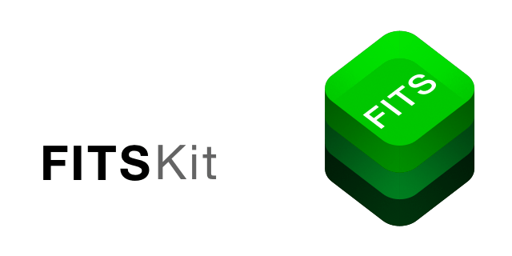

<p align="center">

</p>

<p align="center">
<a href="LICENSE">

</a>
<a href="https://swift.org">

</a>
</p>

A native Swift library to read and write FITS files

## Description

FITSKit is a pure Swift library to process the image data of [FITS 4.0](https://fits.gsfc.nasa.gov/fits_standard.html) file files, commonly used to store astronomical data. 

The aim is to implement a modern, native [Swift](https://swift.org) library to utilize the full computing power of modern apple hardware. In particuary, I was seeking for a simple solution to read, render & review FITS files on an iPad.

FITSKit is a highly plattform depenedend library. It compiles and runs exclusively on iOS / iPadOS / macCatalyst. It utilizes apples standard libraries Core Image and Accelerate to process, render & manipulate image data stored in FITS files. It is meant as an addition to the general FITS file format library [FitsCore](https://github.com/brampf/fitscore).

|  |  |  |
| :---------------------------------------: | :---------------------------------------: | :---------------------------------------: | 
| [**FITSCore**](https://github.com/brampf/fitscore) | [**FITSKit**](https://github.com/brampf/fitskit) | [**FITSTool**](https://github.com/brampf/fitstool) |
|  Fits file format read & write  | Image rendering & manipulation | Command line tool |
|  macOS, iOS & Linux | iOS / macCatalyst | Linux |

## Features
* Read & Write FITS 4.0 files
    * Image format conversion using Accelerate
    * [x| BITPIX 8 support
    * [x] BITPIX 16 support
    * [x] BITPIX 32 support
    * [x] BITPIX 64 support
    * [x] BITPIX -32 support
    * [x] BITPIX -64 support
* Native code
    * Swift 5.4
    * Compiles for macCatalyst
    * Compiles for iPadOS / iOS

## Getting started

### Package Manager

With the swift package manager, add the library to your dependencies
```swift
dependencies: [
.package(url: "https://github.com/brampf/fitkit.git", from: "0.1.0")
]
```

then simply add the `FITSKit` import to your target

```swift
.target(name: "YourApp", dependencies: ["FITSKit"])
```

## Documentation

There are several decoders to decode the raw image data of an FITS `DataUnit` into either an `CGImage` or into an `vImage_Buffer` 
 * [GrayscaleDecoder](Sources/FITSKit/Decoder/GrayscaleDecoder.swift) : Renders grayscale images from two-dimensional data
 * [RGBDecoder](Sources/FITSKit/Decoder/RGBDecoder.swift) : Renders RGB images from tree-dimensional data
 * [BayerDecoder](Sources/FITSKit/Decoder/BayerDecoder.swift) : Renders RGB images from two-dimensional data
 
 **Please note:** Decoders only translate the raw byte patterns into processable images and does not apply color correction of any kind.

#### Don't care, just give me a picture, alright?
```swift
import FITSKit

let image = try file.prime.decode()
```

#### Grayscale Decoder
Applicable on two-dimensional (NAXIS == 2) data units
```swift
import FITSKit

let image = try file.prime.decode(GrayscaleDecoder.self, ())
```

#### RGB Decoder
Applicable on three-dimensional (NAXIS == 3) data units
```swift
import FITSKit

let image = try file.prime.decode(RGB_Decoder<RGB>.self, ())
}
```
The RGB Decoder allows parametrization of the output and can also decode grayscale images 
```swift
import FITSKit

let image = try file.prime.decode(RGB_Decoder<Mono>.self, ())
}
```

#### Bayer Decoder (De-Bayering / Demosaic)
Applicable on two-dimensional (NAXIS == 2) data units
```swift
import FITSKit

let image = try file.prime.decode(BayerDecoder.self, .RGGB)
}
```


## License

MIT license; see [LICENSE](LICENSE.md).
(c) 2021
